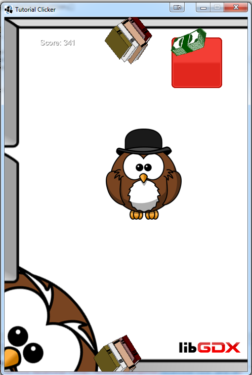

# tutorialclicker
Practical programming with libgdx. 

##
It is easy game which counts mouse clicks and make visual effects. Some of functionality are based on webservice written in Python (http://adriannikiel.pythonanywhere.com/tutorialclicker/api/v1.0/features).

Application is working on different platforms: Windows, Linux, Mac OS X, Android, iOS, BlackBerry and web browsers with WebGL support.
Core is written in TutorialClicker-core -> there are files shared by another platforms. Specific things for platform are in folders: android, desktop, ios etc.

